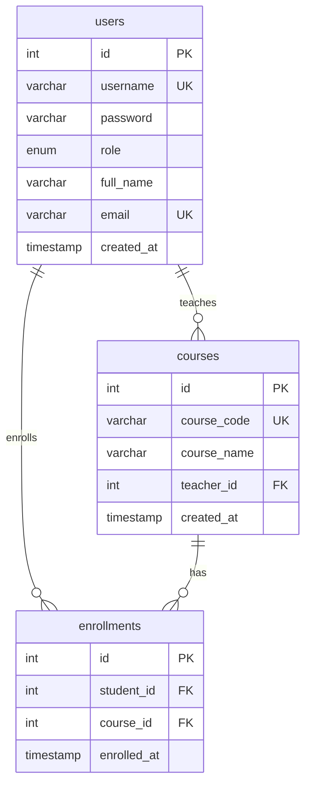

# 🎓 Academia - Learning Management System

A comprehensive web-based Learning Management System (LMS) built with Java, JSP, and MySQL. Academia provides a complete platform for managing courses, users, and enrollment with role-based dashboards for administrators, teachers, and students.


---

## 📋 Table of Contents

- [Project Structure](#-project-structure)
- [Features](#-features)
- [Technology Stack](#-technology-stack)
- [Prerequisites](#-prerequisites)
- [Installation](#-installation)
- [Database Setup](#-database-setup)
- [Running the Application](#-running-the-application)
- [User Roles & Functionality](#-user-roles--functionality)
- [UI Highlights](#-ui-highlights)
- [Future Enhancements](#-future-enhancements)
- [Database Schema](#-database-schema)

---

## 📁 Project Structure

```
Academia/
├── .classpath
├── .project
├── .settings/
├── build/                          # Compiled classes
├── src/
│   └── main/
│       ├── java/
│       │   └── nazmul/
│       │       ├── AddCourseServlet.java        # Admin creates courses
│       │       ├── AuthFilter.java              # Authentication filter
│       │       ├── Course.java                  # Course model
│       │       ├── CourseDAO.java               # Course database operations
│       │       ├── DatabaseUtil.java            # Database connection utility
│       │       ├── DeleteCourseServlet1.java    # Admin deletes courses
│       │       ├── EditCouraseServlet1.java     # Admin edits courses
│       │       ├── EnrollCourseServlet.java     # Student enrolls in courses
│       │       ├── HomeServlet.java             # Landing page servlet
│       │       ├── LoginServlet.java            # User authentication
│       │       ├── RegistrationServlet.java     # User registration
│       │       ├── RoleFilter.java              # Role-based access control
│       │       ├── UpdateProfileServlet.java    # Profile updates
│       │       ├── User.java                    # User model
│       │       ├── UserDAO.java                 # User database operations
│       │       └── ViewCourseStudentsServlet.java # Teacher views students
│       └── webapp/
│           ├── WEB-INF/
│           │   └── web.xml                      # Web application config
│           ├── adminDashboard.jsp               # Admin interface
│           ├── home.jsp                         # Landing page
│           ├── login.jsp                        # Login page
│           ├── logout.jsp                       # Logout handler
│           ├── register.jsp                     # Registration page
│           ├── studentDashboard.jsp             # Student interface
│           ├── teacherDashboard.jsp             # Teacher interface
│           └── viewStudents.jsp                 # View enrolled students
└── README.md
```

---

## ✨ Features

### 🔐 **Authentication & Authorization**

| Feature | Description |
|---------|-------------|
| 👤 **User Registration** | Create accounts with role selection (Admin/Teacher/Student) |
| 🔑 **Secure Login** | Session-based authentication with role verification |
| 🛡️ **Access Control** | Role-based filters ensure users only access authorized pages |
| 👨‍💼 **Profile Management** | Update personal information, email, and credentials |

---

### 👨‍💼 **Admin Dashboard**

<table>
<tr>
<td width="50%">

#### 📊 **System Overview**
- View total courses count
- Track number of teachers
- Monitor total students
- Real-time statistics display

</td>
<td width="50%">

#### 👥 **User Management**
- View all registered users
- Filter by role (Admin/Teacher/Student)
- Access user details
- Manage user accounts

</td>
</tr>
<tr>
<td width="50%">

#### 📚 **Course Management**
- ➕ Create new courses
- ✏️ Edit course details
- 🗑️ Delete courses
- 👨‍🏫 Assign teachers to courses

</td>

</tr>
</table>

---

### 👨‍🏫 **Teacher Dashboard**

<table>
<tr>
<td width="50%">

#### 📖 **My Courses**
- View all assigned courses
- See course details (code & name)
- Track student enrollment count
- Beautiful course card displays

</td>
<td width="50%">

#### 👨‍🎓 **Student Management**
- View enrolled students per course
- Access student contact information
- See student email addresses
- Monitor class rosters

</td>
</tr>
<tr>
<td width="50%">

#### 👤 **Profile Management**
- Update personal information
- Change contact details
- Modify credentials
- Edit profile settings

</td>

</tr>
</table>

---

### 👨‍🎓 **Student Dashboard**

<table>
<tr>
<td width="50%">

#### 🏪 **Course Marketplace**
- Browse all available courses
- View course details
- See assigned teachers
- ➕ One-click enrollment

</td>
<td width="50%">

#### 📚 **My Learning Journey**
- View all enrolled courses
- Track course progress
- Visual progress indicators
- Quick course access

</td>
</tr>
<tr>
<td width="50%">

#### 📊 **Statistics & Overview**
- Count of enrolled courses
- Available courses to join
- Learning progress tracking
- Achievement indicators

</td>

</tr>
</table>

---

### 🎨 **Modern UI/UX Features**

| Category | Features |
|----------|----------|
| 📱 **Responsive Design** | Works seamlessly on desktop, tablet, and mobile devices |
| ✨ **Glassmorphism** | Modern frosted glass effect cards with backdrop filters |
| 🎬 **Smooth Animations** | Fade-in effects, hover transitions, micro-interactions |
| 🌈 **Dynamic Backgrounds** | Animated gradient backgrounds unique to each role |
| 🎨 **Color-Coded Roles** | Admin (Purple), Teacher (Blue), Student (Blue-Purple) |
| 🔤 **Modern Typography** | Clean fonts with proper hierarchy and spacing |
| 🖼️ **Icon Library** | Font Awesome 6 icons throughout the interface |

---

## 🛠 Technology Stack

### Backend
- **Java Servlets**: Server-side logic and routing
- **JSP (JavaServer Pages)**: Dynamic page rendering
- **JDBC**: Database connectivity
- **MySQL**: Relational database management

### Frontend
- **HTML5**: Semantic markup
- **CSS3**: Modern styling with custom properties and animations
- **Bootstrap 5.3**: Responsive grid system and components
- **Font Awesome 6**: Icon library
- **JavaScript**: Client-side interactivity

### Server
- **Apache Tomcat**: Servlet container (recommended version 9.x or 10.x)
- **Java EE**: Web application framework

### Development Tools
- **Eclipse IDE**: Primary development environment
- **Maven** (optional): Dependency management
- **MySQL Workbench**: Database administration

---

## 📦 Prerequisites

Before running this project, ensure you have the following installed:

- **Java Development Kit (JDK)**: Version 8 or higher
  - Download from [Oracle](https://www.oracle.com/java/technologies/downloads/) or [OpenJDK](https://openjdk.org/)
  
- **Apache Tomcat**: Version 9.x or 10.x
  - Download from [Apache Tomcat](https://tomcat.apache.org/download-90.cgi)
  
- **MySQL Server**: Version 5.7 or higher
  - Download from [MySQL](https://dev.mysql.com/downloads/mysql/)
  
- **IDE**: Eclipse IDE for Java EE Developers (recommended)
  - Download from [Eclipse](https://www.eclipse.org/downloads/)

- **MySQL Connector/J**: JDBC Driver for MySQL
  - Should be placed in `WEB-INF/lib` or added to project classpath

---

## 🚀 Installation

### 1. Clone the Repository

```bash
git clone https://github.com/Nazmul1005/Academia.git
cd Academia
```

### 2. Configure Database Connection

Update the database credentials in `src/main/java/nazmul/DatabaseUtil.java`:

```java
private static final String URL = "jdbc:mysql://localhost:3306/Academia";
private static final String USER = "your_mysql_username";
private static final String PASSWORD = "your_mysql_password";
```

### 3. Add MySQL Connector

Download [MySQL Connector/J](https://dev.mysql.com/downloads/connector/j/) and add it to:
- `src/main/webapp/WEB-INF/lib/` directory
- Or add it to your project's build path in Eclipse

### 4. Import Project into Eclipse

1. Open Eclipse IDE
2. Go to `File` → `Import` → `Existing Projects into Workspace`
3. Select the cloned Academia directory
4. Click `Finish`

---

## 🗄 Database Setup

### 1. Create Database

Open MySQL Workbench or MySQL command line and run:

```sql
CREATE DATABASE Academia;
USE Academia;
```

### 2. Create Tables

#### Users Table

```sql
CREATE TABLE users (
    id INT AUTO_INCREMENT PRIMARY KEY,
    username VARCHAR(50) UNIQUE NOT NULL,
    password VARCHAR(255) NOT NULL,
    role ENUM('admin', 'teacher', 'student') NOT NULL,
    full_name VARCHAR(100) NOT NULL,
    email VARCHAR(100) UNIQUE NOT NULL,
    created_at TIMESTAMP DEFAULT CURRENT_TIMESTAMP
);
```

#### Courses Table

```sql
CREATE TABLE courses (
    id INT AUTO_INCREMENT PRIMARY KEY,
    course_code VARCHAR(20) UNIQUE NOT NULL,
    course_name VARCHAR(100) NOT NULL,
    teacher_id INT,
    created_at TIMESTAMP DEFAULT CURRENT_TIMESTAMP,
    FOREIGN KEY (teacher_id) REFERENCES users(id) ON DELETE SET NULL
);
```

#### Enrollments Table

```sql
CREATE TABLE enrollments (
    id INT AUTO_INCREMENT PRIMARY KEY,
    student_id INT NOT NULL,
    course_id INT NOT NULL,
    enrolled_at TIMESTAMP DEFAULT CURRENT_TIMESTAMP,
    FOREIGN KEY (student_id) REFERENCES users(id) ON DELETE CASCADE,
    FOREIGN KEY (course_id) REFERENCES courses(id) ON DELETE CASCADE,
    UNIQUE KEY unique_enrollment (student_id, course_id)
);
```

### 3. Insert Sample Data (Optional)

#### Create Admin User

```sql
INSERT INTO users (username, password, role, full_name, email) 
VALUES ('admin', 'admin123', 'admin', 'System Administrator', 'admin@academia.edu');
```

#### Create Sample Teachers

```sql
INSERT INTO users (username, password, role, full_name, email) 
VALUES 
('teacher1', 'pass123', 'teacher', 'Dr. John Smith', 'john.smith@academia.edu'),
('teacher2', 'pass123', 'teacher', 'Dr. Sarah Johnson', 'sarah.johnson@academia.edu');
```

#### Create Sample Students

```sql
INSERT INTO users (username, password, role, full_name, email) 
VALUES 
('student1', 'pass123', 'student', 'Alice Brown', 'alice.brown@student.academia.edu'),
('student2', 'pass123', 'student', 'Bob Wilson', 'bob.wilson@student.academia.edu');
```

#### Create Sample Courses

```sql
INSERT INTO courses (course_code, course_name, teacher_id) 
VALUES 
('CSE101', 'Introduction to Computer Science', 2),
('CSE201', 'Data Structures and Algorithms', 2),
('MATH101', 'Calculus I', 3);
```

---

## ▶️ Running the Application

### Using Eclipse

1. **Configure Tomcat Server in Eclipse**:
   - Go to `Window` → `Preferences` → `Server` → `Runtime Environments`
   - Click `Add`, select `Apache Tomcat v9.0` (or your version)
   - Browse to your Tomcat installation directory
   - Click `Finish`

2. **Add Project to Server**:
   - Right-click on the project → `Run As` → `Run on Server`
   - Select your configured Tomcat server
   - Click `Finish`

3. **Access the Application**:
   - Open your browser and navigate to: `http://localhost:8080/Academia_nazmul/`
   - Or: `http://localhost:8080/Academia_nazmul/home`

### Using Command Line

1. **Build the WAR file**:
   ```bash
   # If using Maven
   mvn clean package
   
   # Manual build
   # Copy all files to Tomcat's webapps directory
   ```

2. **Deploy to Tomcat**:
   ```bash
   cp Academia.war $TOMCAT_HOME/webapps/
   ```

3. **Start Tomcat**:
   ```bash
   cd $TOMCAT_HOME/bin
   ./catalina.sh run    # Linux/Mac
   catalina.bat run     # Windows
   ```

---

## 👥 User Roles & Functionality

### 🔴 Admin
**Access Level**: Full system control

**Capabilities**:
- Create, edit, and delete courses
- Assign teachers to courses
- View all users (admins, teachers, students)
- System-wide statistics and overview
- Manage course catalog

**Dashboard Features**:
- Total courses, teachers, and students count
- Course management table with actions
- User directory with role filters
- Quick actions for common tasks

---

### 🔵 Teacher
**Access Level**: Course and student management

**Capabilities**:
- View assigned courses
- See enrolled students in each course
- Access student contact information
- Update personal profile
- Monitor course enrollment

**Dashboard Features**:
- "My Courses" section with course cards
- Student list for each course
- Course statistics (student count)
- Profile management

---

### 🟢 Student
**Access Level**: Course enrollment and learning

**Capabilities**:
- Browse available courses (marketplace)
- Enroll in courses with one click
- View enrolled courses (learning journey)
- Track course progress
- Update personal profile

**Dashboard Features**:
- Course marketplace with available courses
- Enrolled courses with progress indicators
- Quick enrollment actions
- Statistics on enrolled and available courses

---


## 📊 Database Schema



---

